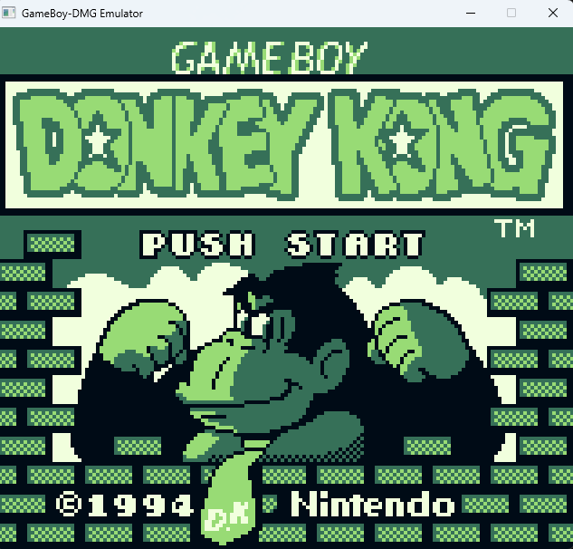
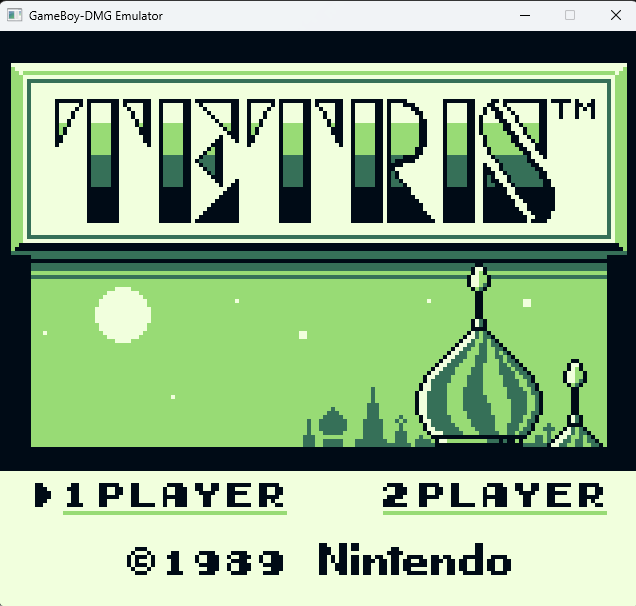
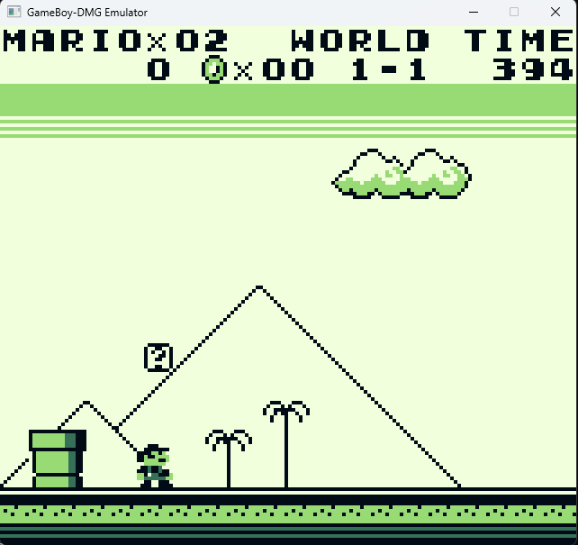

# shiny-cart

A golang GameBoy emulator (DMG) created as a side project, just for fun.

The emulator currently passes all blargg's cpu instructions tests.

Still no sound support and no color (GBC) support (yet).

## Keyboard layoyt

Action buttons are mapped as below, direction buttons are mapped using left, up, right and down keys, respectively.

| Button A | Button B | Start | Select |
|----------|----------|-------|--------|
| Key A    | Key S    | Key Q | Key W  |

## Screen shots

### Donkey Kong World

### Tetris

### Super Mario Land

